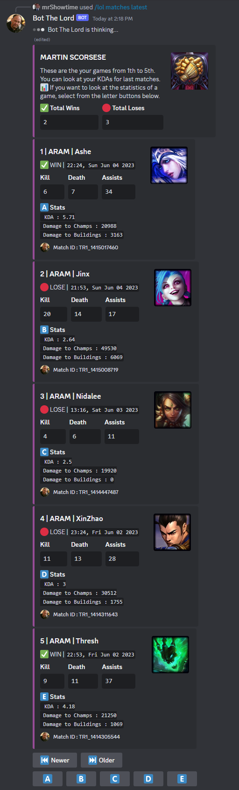
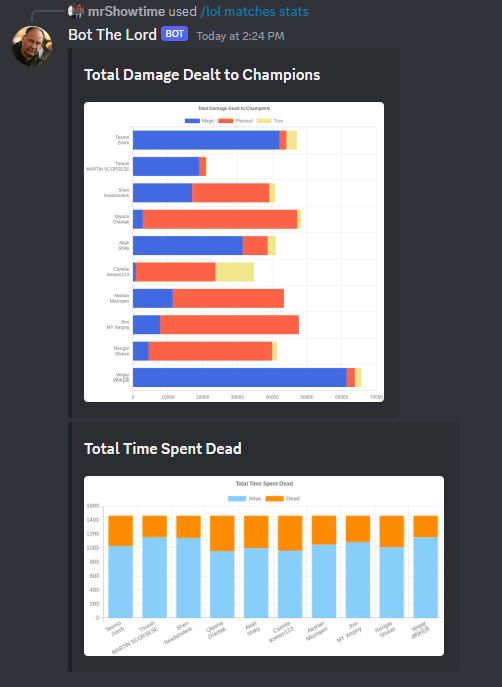
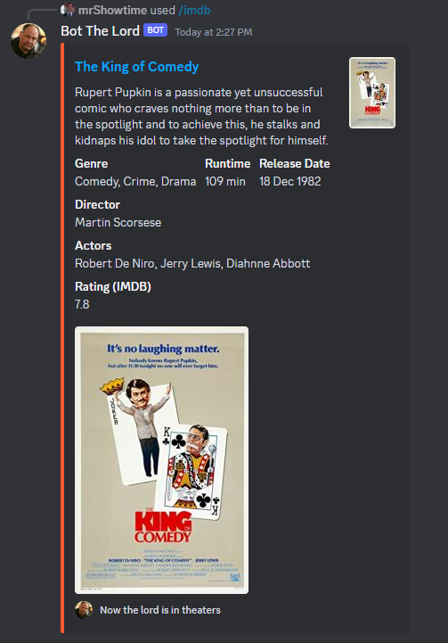
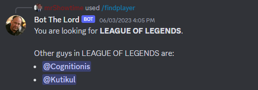
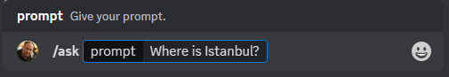
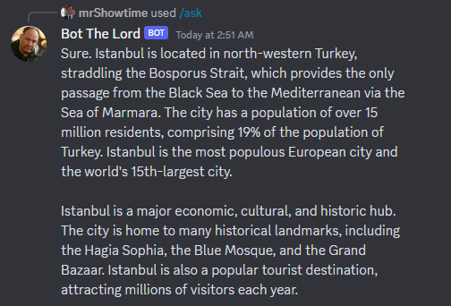

# unnecessary-discord-bot

This is an Discord bot which has unnecessary but nice-to-have functionalities for a Discord server where there are League of Legends players, film enthusiast and loveful community. Unnecessary Discord Bot depends on the latest DiscordJS version and it's slash commands. The commands is explained below.

The bot also uses multiple API services: [RIOT API](https://developer.riotgames.com/) and [OMDb API](https://www.omdbapi.com/).

More unnecessary functions were planned to be added.

## **Features**

Let's look at those functions:

### League of Legends summoner and match informations ( `/lol` )

- Rank statistics of a LoL player

> 👽 **`/lol summoner rank`** `summoner-name:` `summoner-region:`

> 

> **Note**
> **Look at last 5 matches** button executes `/lol matches latest` command for same summoner-name and summoner-region.

- Show matches and KDA statistics

> 👽 **`/lol matches latest`** `summoner-name:` `summoner-region:`

Brings the last 5 matches of a player with KDA and damage statistics. You can look at older or newer matches with `Newer` and `Older` buttons.

> 

> **Note**
> **A-B-C-D-E** buttons executes `/lol matches stats` for selected match's id and brings the detailed statistics with graphs of selected matches. In the match card you can see the assigned letter.

- Visualized match statistics

> 👽 **`/lol matches stats`** `match-id:`

Brings couple of statistics of matches. Planned to be upgraded with rich charts.

> 

> **Note**
> The data comes from RIOT API.

#### Movie search and suggestion

> 🎬 **`/imdb`** `name:`

Brings the information of a movie.

> 

> **Note**
> The data comes from OMDb API.

#### Find players that you can play with

> 🔍 **`/findplayer`** `game: (optional)`

There are two ways to use that command:
- Give game name and find the guys playing same game.
- Do not give a name and find the guys doing same thing as you do.

> 

#### Ask question *(to the Google Bard)*

> 🧙‍♂️ **`/ask`** `prompt:`

Ask question to an LLM model, Google Bard.

> 

> 

## Installation

### Prerequisites

- Node >= 16.9.0

### Install

- Clone the repo
```shell
$ git clone https://github.com/GoktugOcal/unnecessary-discord-bot.git
```

- Install with npm

```shell
$ npm install
```

## .env Requirements

You need to fill the .env file with following properties:

```js
//Discord
APP_ID = {APPLICATION_ID} //Discord application id
TOKEN = {YOUR_BOT_TOKEN} //Discord bot token

//RIOT
RIOT_API = {YOUR_RIOT_API_KEY} //Register and RIOT application and get the API key

//OMDB
OMDB_API = {YOUR_OMBD_API_KEY} //OMDB API key

//BARD
Secure1PSID = {API_KEY_FOR_BARD} //BARD cookie
```

> **Note**
> For **Secure1PSID** token of BARD you can look at the this [Guide](https://generativeai.pub/googles-bard-a-step-by-step-guide-to-using-the-unofficial-bard-api-3abb5b2d6abc).


## Execution

- Simple
```shell
npm run start
```

## Credits:

- [**AdamSEY**](https://github.com/AdamSEY/bard-unofficial-api) : BARD unofficial API.