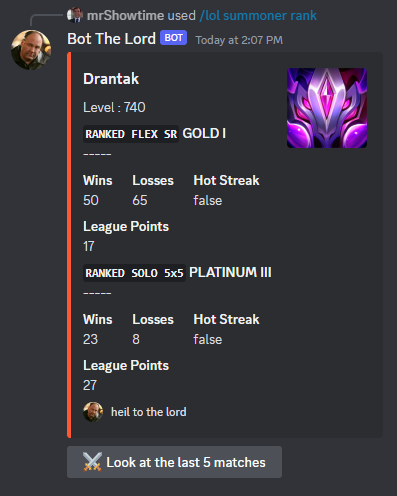

# unnecessary-discord-bot

This is an Discord bot which has unnecessary but nice-to-have functionalities for a Discord server where there are League of Legends players, film enthusiast and loveful community. Unnecessary Discord Bot depends on the latest DiscordJS version and it's slash commands. The commands is explained below.

The bot also uses multiple API services: [RIOT API](https://developer.riotgames.com/) and [OMDb API](https://www.omdbapi.com/).

More unnecessary functions were planned to be added.

## Features

Let's look at those functions:

#### League of Legends summoner and match informations ( `/lol` )

- **/lol summoner rank** : returns the rank statistics of a LoL player.

> 👽 **`/lol summoner rank`** `summoner-name:` `summoner-region:`



#### Movie search and suggestion

#### Find players that you can play with

#### Ask question *(to the Google Bard)*

## Installation

## .env Requirements


A Discord bot with different types of functionalities

```shell
npm i discord.js @discordjs/rest discord-api-types dotenv sync-request quickchart-js random
```

- Fill ".env" with:
```python
APP_ID = {APPLICATION_ID}
TOKEN = {YOUR_BOT_TOKEN}
```

### Slash Commands

### Invite

[https://discord.com/api/oauth2/authorize?client_id=1108511220581015623&permissions=0&scope=bot%20applications.commands](https://discord.com/api/oauth2/authorize?client_id=1108511220581015623&permissions=0&scope=bot%20applications.commands)

Resources: 
- [https://daily-dev-tips.com/posts/creating-a-discord-slash-command-bot/](https://daily-dev-tips.com/posts/creating-a-discord-slash-command-bot/)
- [https://www.youtube.com/watch?v=HBt8MXHcaPI](https://www.youtube.com/watch?v=HBt8MXHcaPI)
- [https://github.com/jeffreyflynt/node-bard](https://github.com/jeffreyflynt/node-bard)